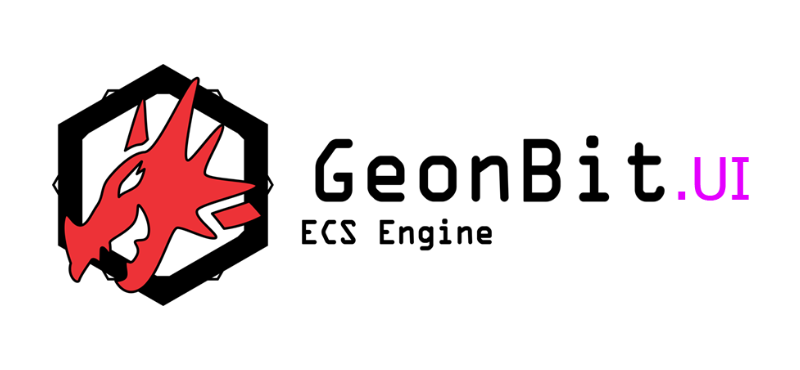

# GeonBit.UI

UI extension for MonoGame-based projects by Ronen Ness.

Get it from: [GeonBit.UI git](https://github.com/RonenNess/GeonBit.UI).

Full API documentation available here: [Online docs](https://ronenness.github.io/GeonBit.UI-docs/).

## What's GeonBit

**GeonBit** is a MonoGame-based game engine, designed to build 3d dungeon crawler and FPR (first person rogue) games.

## What's GeonBit.UI

**GeonBit.UI** is the UI / HUD system of the *GeonBit* engine, exported as an independent MonoGame extension under the MIT license.

It provide all the basic UI elements required to make a game / editor UI, and comes with few built-in UI skins compatible for commerical projects.

To see a GeonBit.UI demo, check out this YouTube video:

[](http://www.youtube.com/watch?v=c7Q-FfKOosA "GeonBit.UI Demo")

## Key Features

GeonBit.UI provide the following functionality:

- Helper class to handle user input and interactions with UI elements.
- Automatic positioning and anchors system that provide an easy way to place elements regardless of screen size.
- Events system to capture and respond to user interactions with UI.
- Smart Paragraphs & Headers with multiline text, automatic word-wrap, outline, and other text effects.
- Panels (framed containers for widgets), with few built-in skins and dragging functionality.
- Buttons with few skins to choose from, toggle mode, and icons.
- Checkboxes and Radio buttons.
- Cursor rendering with few cursor styles (can be disabled if you draw your own cursor).
- Image & Icon widgets (comes with 40+ built-in icons).
- Select Lists with different skins, scrollbars, and dynamic content.
- Dropdown widgets with different skins.
- Slider bars & Progress bars.
- Text boxes for user text input - support multiline, word-wrap, scrollbars and skins.
- PanelTabs to easily create multitabs panels.
- Stylesheets and themes, easily extendable.
- Locked, disabled, shadow, and other basic UI effects and states.
- Global scaling property to support different screen sizes.
- And much more...

## Simple example

In GeonBit.UI you create your GUI layout using plain init code.

For example, the following code:

```cs
// create a panel and position in center of screen
Panel panel = new Panel(new Vector2(400, 400), PanelSkin.Default, Anchor.Center);
UIManager.AddEntity(panel);

// add title and text
panel.AddChild(new Header("Example Panel"));
panel.AddChild(new HorizontalLine());
panel.AddChild(new Paragraph("This is a simple panel with a button."));

// add a button at the bottom
panel.AddChild(new Button("Click Me!", ButtonSkin.Default, Anchor.BottomCenter));
```

Will create the following UI panel at the center of the screen:


## Caveats

Before choosing GeonBit.UI, here are few caveats you should know about:

#### Only tested on windows

GeonBit.UI was developed and tested on 3 different machines, with windows 8 and 10. 
Theoretically It should work on any platform supported by MonoGame, but it might require some tweaks for some devices.

#### Text Input is pretty basic.

The text input widget is pretty basic and don't support advance text editing and things like copy & paste, selection, etc.
So if your project require extensive text editing you might need to do some work on the text input widget.

#### Rely on mouse / touch input

GeonBit.UI is built to work with mouse / touch screens. It is currently not designed for keyboad-only / joystick input (eg it doesn't support tab navigating etc.)

## Git structure

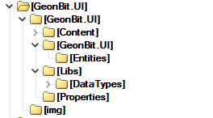

In the repository root you will find the following files and folders: 

1. ```GeonBit.UI.sln```: a Visual Studio solution with GeonBit.UI source + example code.
2. ```Documentation.chm```: full API documentation file (auto-generated).
3. ```GeonBit.UI/```: folder containing all the source code and reousrces of GeonBit.UI.

Inside the ```GeonBit.UI/``` folder you will find the following files and folders:

1. ```Content```: all the resources GeonBit.UI rely on. You will need to import some of it (explained in installation instructions coming up next).
2. ```GeonBit.UI```: GeonBit.UI source code (cs files).
3. ```Libs```: additional libs you need to compile with GeonBit.UI (currently there's only one).
4. ```GeonBitUI_Examples.cs``` and ```program.cs```: GeonBit.UI demo app that demonstrate the different features and entities GeonBit.UI provides.

To see GeonBit.UI live before installing it in your project, you can open and run the solution file. 
Please note however that you might need to install some fonts first from ```GeonBit.UI/Content/Fonts/``` folder.

# Install

GeonBit.UI currently don't have a pre-built distribution as a single dll file (due to some complications I had with resources management & build targets in MonoGame). So in order to use GeonBit.UI you need to integrate the source and content into your project.

While this may sound intrusive, GeonBit.UI integration is actually quite simple and straight-forward, and removing it is just a matter of deleting two folders (source & content) and removing a Referece.

To integrate GeonBit.UI into your project, follow these steps:

1. **Copy source:** Copy the source code from ```GeonBit.UI/GeonBit.UI/``` into your project source root (just copy the whole folder as-is).
2. **Add content:** Copy all the Content from ```GeonBit.UI/GeonBit.UI/Content/GeonBit.UI/``` into your MonoGame pipeline Manager (can be done by clicking on "add folder" and selecting the GeonBit.UI folder).
3. **Install fonts:** You might need to install some fonts that GeonBit.UI uses and don't come by default in windows / linux. To do so, go to the ```GeonBit.UI/GeonBit.UI/Content/Fonts/``` folder and install all the fonts there (they are all free to use including for commercial purposes).
4. **Build DataTypes dll:** Due to the way resources compile in MonoGame, there's a need to compile additional dll that contains serializable data types:
 1. Open the project inside ```GeonBit.UI/GeonBit.UI/Libs/```, build it, and add the output dll (```DataTypes.dll```) to your *Content pipeline* ```References``` property and to your *Project Reference* dlls.
 2. You can build only in ```release``` mode, since you'll probably never need to debug it.
 3. You can use the example ```GeonBit.UI.sln``` solution to quickly build it without opening a new solution file.

That's it. You should now be able to compile and use GeonBit.UI in your projects.

To see a 5-minutes video tutorial illustrating the process, check out this YouTube video:

[](http://www.youtube.com/watch?v=dt3URcN45XM "GeonBit.UI Install")

If you ever choose to remove GeonBit.UI from your project, simply follow these steps:

1. Delete the ```GeonBit.UI``` content folder from your content pipeline.
2. Delete the ```GeonBit.UI``` source folder from your solution / project source code.
3. Remove the ```References``` to the DataTypes dll from the pipeline manager and your project.

## Extra steps for Linux

There are few more things to do if you use Linux:

1. After installing the fonts from ```GeonBit.UI/GeonBit.UI/Content/Fonts/```, you also need to copy the font files into the folder where the spritefont files reside (eg ```Content/GeonBit.UI/themes/<team-name>/fonts/```).
2. Since at this time MonoGame can't build effects on Linux, you need to use a pre-compiled effects. Take the built effects from ```Content/BuiltEffects/``` and put them instead of the ```.fx``` files of your theme (eg ```Content/GeonBit.UI/themes/<team-name>/effects/```). Also change their 'Build Action' from 'Build' to 'Copy'.


# Using GeonBit.UI

Once successfully integrated and project compiles, you can start using GeonBit.UI.

## Setup

GeonBit.UI is built to be called from the MonoGame ```Game``` class in to strategic places - ```Update()``` and ```Draw()```:

1. Create & init a ```UserInterface``` manager in ```Initialize()```.
2. Update the UI manager every frame by calling ```UserInterface.Update()``` in your game ```Update()``` function.
3. Draw the UI every frame by calling ```UserInterface.Draw()``` in your game ```Draw()``` function.

For example, take a look at the following ```Game``` class implementation:

```cs
using Microsoft.Xna.Framework;
using Microsoft.Xna.Framework.Graphics;
using Microsoft.Xna.Framework.Input;
using System.Collections.Generic;

// using GeonBit UI elements
using GeonBit.UI;
using GeonBit.UI.Entities;

namespace GeonBit.UI.Example
{
    /// This is the main class for your game.
    public class GeonBitUI_Examples : Game
    {
        // graphics and spritebatch
        GraphicsDeviceManager graphics;
        SpriteBatch spriteBatch;

        // GeonBit.UI: UI manager instance
        UserInterface UIManager;

		/// Game constructor.
        public GeonBitUI_Examples()
        {
            graphics = new GraphicsDeviceManager(this);
            Content.RootDirectory = "Content";
        }

        /// Allows the game to perform any initialization it needs to before starting to run.
        /// here we create and init the UI manager.
        protected override void Initialize()
        {
            // GeonBit.UI: create and init the UI manager
            UIManager = new UserInterface(Content);
            UIManager.Initialize();

            // GeonBit.UI: tbd create your GUI layouts here..

            // call base initialize func
            base.Initialize();
        }

        /// LoadContent will be called once per game and is the place to load.
        /// here we init the spriteBatch (this is code you probably already have).
        protected override void LoadContent()
        {
            // Create a new SpriteBatch, which can be used to draw textures.
            spriteBatch = new SpriteBatch(GraphicsDevice);
        }

        /// Allows the game to run logic such as updating the world.
        /// here we call the UI manager update() function to update the UI.
        protected override void Update(GameTime gameTime)
        {
            // GeonBit.UIL update UI manager
            UIManager.Update(gameTime);
            
            // tbd add your own update() stuff here..

            // call base update
            base.Update(gameTime);
        }

        /// This is called when the game should draw itself.
        /// here we call the UI manager draw() function to render the UI.
        protected override void Draw(GameTime gameTime)
        {
            // clear buffer
            GraphicsDevice.Clear(Color.CornflowerBlue);

            // GeonBit.UI: draw UI using the spriteBatch you created above
            UIManager.Draw(spriteBatch);

            // call base draw function
            base.Draw(gameTime);
        }
    }
}
```

Executing the code above will result in an empty window with blueish background and the GeonBit.UI cursor rendered on it. 
It should look something like this:

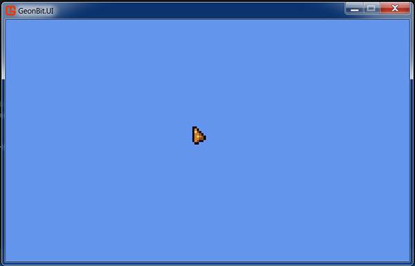

If that worked, you are now ready to start creating your UI by adding entities to the manager.

## Anchors & Positioning

Before we go over the different UI entities, its important to understand how elements are positioned on screen using the **'anchor'** and **'offset'** system.

An "anchor" is basically a pre-defined position inside a container (like top-left corner, center, etc..), while "offset" is the distance (in pixels) from that said position.

For example, you can position an entity with offset of 0, 20 pixels from its parent bottom-center, meaning there will be 20 pixels between the entity bottom and its parent bottom.

The following picture demonstrate all the anchors GeonBit.UI support:

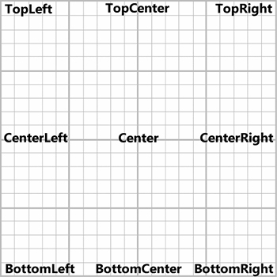

In addition there are few special anchors that are used to place entities automatically one after another.

#### Anchors are relative to parent

Note that when you place an entity using anchors, the anchor will refer to the entity direct parent, and not the entire screen. 
So if, for example, you place a button with a top-left anchor inside a panel - the position of the button will be linked to the top-left corner of the panel, and not the absolute top-left corner of the screen.

### Auto Anchors

Placing everything with anchors and offset can quickly become a tedious job, especially if you have lots of entities that you just want to place one after another. 

To fix that, GeonBit.UI introduce 3 dynamic anchor types: Auto, AutoInline, and AutoCenter.

- **Auto** anchor will position entities in the parent container one after another, with one entity per row, starting from the top-left corner.
- **AutoInline** is the same as *Auto*, but will try to squeeze entities together at the same row, given their accumulated width does not overflow the parent width.
- **AutoCenter** is the same as *Auto*, but will try to align entities to the center of the row.

Note that Auto anchors still support the offset property, which will be taken from the automatically calculated position.

### Mixing Anchors of different types

Mixing auto anchors of different types works just as expected, but when you mix auto anchors with static anchors there's a special behavior you should know about;
 
An auto anchor always takes the position and size of its older sibling to know how to position itself. 
This means that if, for example, you place an auto anchored entity right after an entity with Bottom-left anchor, the Auto-Anchored entity will be placed below the first entity, meaning right below its bottom.

For that reason, whenever you mix Auto Anchors with static Anchors always place the static anchors *last*.


# Entities

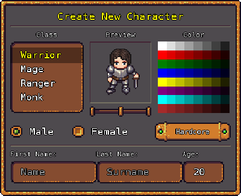

Now we can finally start talking about the different UI entities GeonBit.UI provides, and how to use them, starting from the base UI Entity.

## Base Entity

Docs: [Entity Class]( https://ronenness.github.io/GeonBit.UI-docs/html/T_GeonBit_UI_Entities_Entity.htm ).

Before going over the entities GeonBit.UI has to offer, lets go over the most basic class that all entities inherit from: ```Entity```.

The important members and functions to know about an entity are the following:

### AddChild() / RemoveChild()

Add or remove a child entity, which will be placed inside it.

Note that AddChild() accept a boolean param, ```inheritParentState```, that when set to true the child entity will act as an extension of the parent entity and will always copy its state.

### GetChildren()

Return all entity children.

### ClearChildren()

Remove all children from this entity.

### RemoveFromParent()

Remove this entity from its parent.

### Anchor & Offset

As explained before, these determine the position of the entity inside its parent.

### Size

The size of the entity in pixels. 

Most entities have a default size so you don't need to set it. However, there are three special values that are supported by the size property and you should know:

- Size of 0 means full parent size.
- Size of -1 means default entity size (vary per entity).
- Size between 0.0f and 1.0f (not inclusive) will be percents of parent size (eg 0.5f = 50% of parent size).

So if for example you set an entity size of (0, -1), it means the entity will have its default height with width of 100% of its parent width (minus the padding, which are explained next).

### Padding

Padding (in pixels) to position child entities inside this entity.

Padding property affect both position and size. 
So if, for example, you have an entity in the size of 100, 100 and padding of 20, 20, and you place inside it an entity with top-left Anchor and full size (size property of 0,0), the internal entity will actually start from top-left corner + 20,20, and its size will be 60,60 pixels (-20 from every side).

### Visible

Show / hide this entity and its children.

### Locked

When set to true, this entity and its children will not respond to user input.

### Disabled

Just like locked, but will also add a grayscale effect to the entities.

### SpaceAfter, SpaceBefore

Simple way to add extra spacing before and after this entity (similar to CSS margin property), when using Auto Anchors.

### Draggable

When set to true, users will be able to drag this entity around. While this property is supported by all entities, it is most reasonable to use with ```panels``` and other container-like entities.

Note: when entity is Draggable you can determine weather or not it is limited to its parent boundaries by setting the ```LimitDraggingToParentBoundaries``` property.

### Background

An entity you can attach as a graphical background for this entity. 

Unlike children entities, the Background entity will not invoke events etc. and will always be rendered *behind* this entity.

### AttachedData

An optional object you can attach to this entity to add extra data to it. It will not affect the entity behavior in any way, its just something you can set and retrieve later for whatever purpose.

### Event Callbacks

You can set callbacks to be called on different entity-related events. The available events all entities share are:

- OnMouseDown: called when the mouse left button is pressed on this entity (on the moment of pressing).
- OnMouseUp: called when mouse left button is released on this entity (on the moment of releasing).
- WhileMouseDown: called every frame while mouse left button is down over this entity.
- WhileMouseHover: called every frame while mouse hovers over this entity.
- OnClick: called when mouse left button is released on this entity.
- OnValueChange: called when the value of this entity change (relevant for entities with value only).
- OnMouseEnter: called when mouse enter the entity boundaries.
- OnMouseLeave: called when mouse leave the entity boundaries.
- BeforeDraw: called every frame before we draw this entity (only if visible).
- AfterDraw: called every frame after we draw this entity (only if visible).
- BeforeUpdate: called every frame before entity update().
- AfterUpdate: called every frame after entity update().
- OnStartDrag: called when a user start dragging this entity.
- OnStopDrag: called when a user stop dragging this entity.
- WhileDragging: called every frame while user is dragging this entity.

All event callbacks receive one parameter, which is the ```Entity``` the event came from. 
Note that you can either register an event callback on a specific entity to respond only to it, or register on the global ```UserInterface``` class to be called for any entity invoking the event.

The global option can be useful for stuff like adding sound when user click on an entity, etc.

### SetStyleProperty()

Set style property for a given state.
For example:

```cs
entity.SetStyleProperty("FillColor", Color.Blue, EntityState.MouseHover);
```

Will set the fill color to blue, whenever mouse hover over the entity.
Styles will be covered extensively later.

### State

Get / set the current entity state (default / mouse hover / mouse down).

Note that if you override the state it will just be overrided again the next ```Update()``` call.

### FillColor

Set / get the default fill color style property.

### ShadowColor

Set / get the default shadow color style property.

### ShadowOffset

Set / get the default shadow offset style property.

### ShadowScale

Set / get the default shadow scale style property.

### Scale

Set / get the default scale style property.

### OutlineColor

Set / get the default outline color style property.

### OutlineWidth

Set / get the default outline width style property.

### IsDisabled()

Return true if this entity is disabled right now, including if disabled due to a parent being disabled.

### IsLocked()

Return true if this entity is locked right now, including if locked due to a parent being locked.

### IsVisible()

Return true if this entity is really visible right now, also check parents to make sure they are all visible.

### IsDeepChildOf()

Check if this entity is a child or a descendant of another entity.

### SetPosition()

Change entity anchor and position.

### SetAnchor()

Change entity anchor.

### SetOffset()

Change entity offset.

### Find()

Find a child with specific type and identifier. This function can either search recursively or look only in direct children.

### IterateChildren()

Iterate over children and apply a callback function on them.

### BringToFront()

Move this entity to be at the front of all the children inside its direct parent. This is equivalent to just adding this entity last.

## Entity StyleSheets

It was briefly mentioned before that ```Entities``` have StyleSheets (when talking about ```Entity.SetStyleProperty()```). So what is a stylesheet?

A stylesheet is like a very, *very* simple CSS-like set of rules. Basically every entity have 3 possible states - **default**, **mouse hover**, and **mouse down**, and for every state we can have a different set of style rules to apply.

For example, you can use styles to turn a paragraph's outline color blue when mouse hovers over it.

All default style properties are defined as part of the Theme, but you can always change styles for specific entity instance.

Note that when a style property is not defined for a certain state (for example if you didn't define fill color for mouse down), the default styling will be used.

The following style properties are available for all entities and states:

### Scale [float]

Scale the entity size, or in text-related entities change the font size.

### FillColor [color]

Entity primary color. For things like images, panels etc. this propertly will act as a tint color effect.

### OutlineColor [color]

Outline color, if defined.

### OutlineWidth [int]

Outline width, or 0 for no outline.

### ForceAlignCenter [bool]

Relevant only for text entities, when set to true will always align the text to center.

### FontStyle [enum]

Relevant only for text entities, determine font style (regular / bold / italic).

### SelectedHighlightColor [color]

Relevant for entities where you can select parts (like select list). Determine selection highlight color.

### ShadowColor [color]

Entity shadow color. Set to alpha 0 (or ```Color.Transparent```) for no shadow.

### ShadowOffset [vector2]

Shadow distance from entity original position.

### ShadowScale [float]

Shadow scale (multiple base entity size).

### Padding [vector2]

Internal padding, for positioning and scaling children entities.

### SpaceAfter [vector2]

Extra space, in pixels, to hold after this entity when using auto anchors.

### SpaceBefore [vector2]

Extra space, in pixels, to hold before this entity when using auto anchors.


# Entity Types

The following are all the entities available in GeonBit.UI.


## Panel

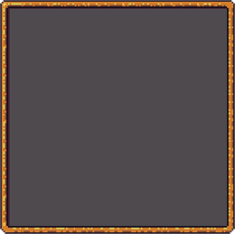

Docs: [Panel Class]( https://ronenness.github.io/GeonBit.UI-docs/html/T_GeonBit_UI_Entities_Panel.htm ).

The most basic entity in GeonBit.UI is the panel entity.

A panel is just a container, either with a graphic frame or without any skin, that you place anywhere on the screen and add entities to it.

While you don't have to use panels to place entities (eg you can just add entities directly to the UI manager), its a good practice to use them as a method to group together layout parts.

### Creating a panel

To create a new panel and add it to the screen, use the following syntax:

```cs
// create a panel with default skin and anchor, at the size of 500x500, and add to UI manager.
// panels default anchor is the center of the screen, so this will create a panel in the center.
Panel panel = new Panel(new Vector2(500, 500));
UIManager.AddEntity(panel);
```

Or to create with different skin and advance parameters:

```cs
// create a panel at the top-left corner of with 10x10 offset from it, with 'Golden' panel skin.
// to see more skins check out the PanelSkin enum options or look at the panel examples in the example project.
Panel panel = new Panel(size: new Vector2(500, 500), skin: PanelSkin.Golden, anchor: Anchor.TopLeft, offset: new Vector2(10, 10));
UIManager.AddEntity(panel);
```

If you want a panel without frame, just use ```PanelSkin.None```.

Note that ```UIManager.AddEntity()``` accept any type of entity, but from now on in all of our examples we'll be adding entities to a panel, and not directly to the manager.


## Paragraph

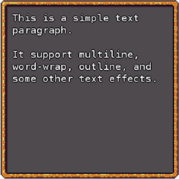

Docs: [Paragraph Class]( https://ronenness.github.io/GeonBit.UI-docs/html/T_GeonBit_UI_Entities_Paragraph.htm ).

Paragraph is a multiline text paragraph you can add to your UI. It can be a simple inline label, or a long, multiline text.

To create a new Paragraph:

```cs
// create a simple paragraph and add it to a panel we created before
Paragraph paragraph = new Paragraph("Hello world!");
panel.AddChild(paragraph);
```

Or to create a paragraph with advance parameters:

```cs
Paragraph paragraph = new Paragraph(text: "hello world", anchor: Anchor.Center, color: Color.Red, scale: 1.4f, size: new Vector2(100, 100), offset: new Vector2(10, 10));
```

### Paragraph API

In addition to the basic API that every UI entity shares, ```Paragraph``` provide the following API:

#### Text

The paragraph text itself. Support newline characters (```\n```) and can be changed dynamically after paragraph creation.

#### WrapWords

If true (default) text will break to fit parent width (meanings long sentences will not go beyond parent width).

#### TextStyle

Default font style property (regular / bold / italic).

#### AlignToCenter

Default align-to-canter style property (when true will align text to center).


## Header

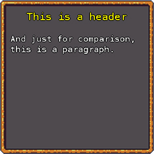

Docs: [Header Class]( https://ronenness.github.io/GeonBit.UI-docs/html/T_GeonBit_UI_Entities_Header.htm ).

Header is just like a paragraph, but with different default styling. It doesn't provide any new functionality but rather a simple way to create pre-defined header text types.

To create a new header:

```cs
// create a simple header and add it to a panel we created before
Header header = new Header("This Is Header");
panel.AddChild(header);
```


## Label

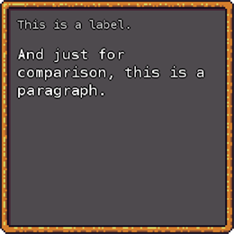

Docs: [Label Class]( https://ronenness.github.io/GeonBit.UI-docs/html/T_GeonBit_UI_Entities_Label.htm ).

Label is just like a paragraph, but with different default styling. It doesn't provide any new functionality but rather a simple way to create pre-defined label text types.

To create a new label:

```cs
// create a simple label and add it to a panel we created before
Label label = new Label("This Is a label");
panel.AddChild(label);
```


## Button

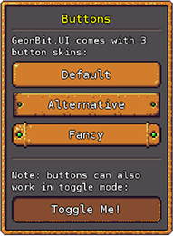

Docs: [Button Class]( https://ronenness.github.io/GeonBit.UI-docs/html/T_GeonBit_UI_Entities_Button.htm ).

Buttons are clickable images with label. Usually when using buttons you'll also register an ```OnClick``` event handler, to respond whenever the user click on it.

To create a new button:

```cs
// create a button with default skin and "Default" label on it, and add it to a panel we created before
Button button = new Button("Default");
panel.AddChild(button);
```

To create a button with different skin and advanced parameters:

```cs
// will create a button with label "Button label", alternative skin, anchored to top-center, with 100 pixels height, and 50 pixels below container's top
Button button = new Button(text: "Button label", skin: ButtonSkin.Alternative, anchor: Anchor.TopCenter, size: new Vector2(0, 100), offset: new Vector2(0, 50));
```

### Events

To listen and respond to the button being clicked, use the ```OnClick``` event handler:

```cs
button.OnClick = (Entity btn) => { 
	// button was clicked, do something here!
};
```

### Button API

In addition to the basic API that every UI entity shares, ```Button``` provide the following API:

#### ButtonParagraph

The label that appears on the button. This is just a paragraph instance that can be accessed from outside to change the text properties of the button.

#### ToggleMode

If true, this button will behave like a checkbox, meaning that clicking it will make the button stay pressed down and in 'checked' mode, and clicking it again will release and uncheck it.

When in toggle mode, you can also register to the ```OnValueChange``` event to detect whenever the button is toggled, and use ```Checked``` to get / set the button current value.

#### Checked

When button is in ```toggle mode```, set / get the button pressed mode.

#### SetCustomSkin

You can override the default theme button textures for a specific instance, by using the SetCustomSkin() function. 
This function get 3 textures (one texture for every button state), and an optional vector indicating frame width in texture file.

#### Skin

Get / set current button skin.


## Checkbox

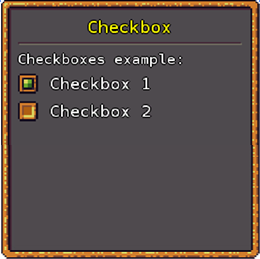

Docs: [CheckBox Class]( https://ronenness.github.io/GeonBit.UI-docs/html/T_GeonBit_UI_Entities_CheckBox.htm ).

A checkbox is a label with a box next to it you can either check or uncheck. Its useful for boolean questions, such as "enable sound" etc.

To create a new CheckBox:

```cs
// create a checkbox with the label "Checkbox 1", and add it to a panel we created before
CheckBox check = new CheckBox("some question..");
panel.AddChild(check);
```

To create a CheckBox with advance parameters:

```cs
CheckBox check = new CheckBox(text: "some question..", anchor: Anchor.Auto, offset: new Vector2(10, 10));
```

### Events

To listen and respond to whenever the CheckBox value changes, use the ```OnValueChange``` event handler:

```cs
check.OnValueChange = (Entity checkbox) => { 
	// checkbox was changed, do something here!
};
```

### Checkbox API

In addition to the basic API that every UI entity shares, ```CheckBox``` provide the following API:

#### TextParagraph

The label that appears on the CheckBox. This is just a paragraph instance that can be accessed from outside to change the text properties of the CheckBox.

#### Checked

Set / get the value of the CheckBox, eg weather or not its currently marked as checked.


## RadioButton

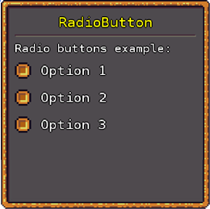

Docs: [RadioButton Class]( https://ronenness.github.io/GeonBit.UI-docs/html/T_GeonBit_UI_Entities_RadioButton.htm ).

A Radio Button behaves just like a CheckBox, with the main difference that only one radio may be checked at a time. 
In other words, once you mark a Radio Button as checked, all its sibling Radio Buttons will be unchecked automatically.

Radio Buttons are useful for multiple choice questions where only one answer can be picked, for example if you ask the user to pick DirectX or OpenGL, UI language choice, etc.. 

Its important to note that the Radio Button only affect its direct siblings under the same parent, meaning that if you want to have a multiple groups of Radio Buttons under the same panel you can just group them together in seperate skinless panels (skin set to ```None```).

To create a new Radio Button:

```cs
// create a radio button with the label "Option 1", and add it to a panel we created before
RadioButton radio = new RadioButton("Option 1");
panel.AddChild(radio);
```

To create a Radio Button with advance parameters:

```cs
RadioButton radio = new RadioButton(text: "Option 1", anchor: Anchor.Auto, offset: new Vector2(10, 10));
```

### Events

Just like with CheckBox, to listen and respond to value changes in Radio Buttons use the ```OnValueChange``` event handler:

```cs
radio.OnValueChange = (Entity entity) => { 
	// radio was changed, do something here!
};
```

Note that when you check a radio button and it uncheck a sibling, the ```OnValueChange``` of the sibling will be triggered as well.

### RadioButton API

```RadioButton``` inherit from ```CheckBox``` and provide the same API, without any additions.


## SelectList

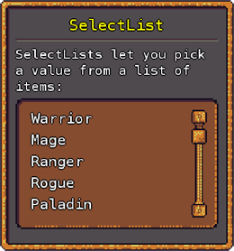

Docs: [SelectList Class]( https://ronenness.github.io/GeonBit.UI-docs/html/T_GeonBit_UI_Entities_SelectList.htm ).

A SelectList is a list of (string) values the user can pick from. You can also add / remove items dynamically via code at runtime.

To create a new SelectList and add items to it:

```cs
// create a list with the size of (full-width, 280), add 3 items to it, and add it to a panel we created before
SelectList list = new SelectList(new Vector2(0, 280));
list.AddItem("item1");
list.AddItem("item2");
list.AddItem("item3");
panel.AddChild(list);
```

Note that the SelectList is made of a panel with paragraphs on it, meaning you can use any panel skin as the list background.
To create a SelectList with different skin and advance parameters:

```cs
SelectList list = new SelectList(size: new Vector2(0, 200), anchor: Anchor.Center, offset: new Vector2(0, 10), skin: PanelSkin.Golden);
```

If the list length is too big for the SelectList physical size, a scrollbar will be added automatically.

### Events

To listen and respond to when a user select an item from the list, use the ```OnValueChange``` event handler:

```cs
list.OnValueChange = (Entity entity) => { 
	// a user picked an item from the list
};
```

### SelectList API

In addition to the basic API that every UI entity shares, ```SelectList``` provide the following API:

#### AddItem()

Add an item to the list. By default will append to the end, but you can also provide an index to insert into.

Note that its possible to add duplicated values, but it will cause annoying behavior when you try to select by-value or remove the item later (on item remove it will always pick the first found value and remove it).

#### RemoveItem()

Remove an item from the list by value or index.

#### ClearItems()

Remove all items from list.

#### Count

Return how many items currently in list.

#### Empty

Return if the list is currently empty.

#### SelectedValue

Get / set the currently selected value as string.

- When no value is selected, null will be returned. 
- To unselect you can set this property to null.

#### SelectedIndex

Get / set the currently selected index as int.

- When no value is selected, -1 will be returned. 
- To unselect you can set this property to -1.

#### Unselect()

Unselect current value. This is the same as setting ```SelectedValue``` to null.

#### ScrollPosition

Get / set the current scrollbar position (if there is a visible scrollbar).

#### ScrollToSelected()

If there's a scrollbar on list, will scroll list to show the currently selected value.

#### scrollToEnd()

If there's a scrollbar on list, will scroll to the bottom of the list.


## DropDown

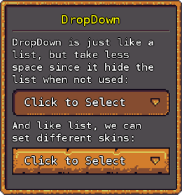

Docs: [DropDown Class]( https://ronenness.github.io/GeonBit.UI-docs/html/T_GeonBit_UI_Entities_DropDown.htm ).

A DropDown is just like a list, but only shows the currently selected value, unless clicked on. This is a way to save UI space when the user don't interact with the list.

To create a new DropDown and add items to it:

```cs
// create a dropdown with the size of (full-width, 280), add 3 items to it, and add it to a panel we created before
DropDown drop = new DropDown(new Vector2(0, 280));
drop.AddItem("item1");
drop.AddItem("item2");
drop.AddItem("item3");
panel.AddChild(drop);
```

The size of the DropDown refer to the size of the list component when opened.

Note that just like the SelectList, DropDown uses panels as background so you can use any panel skin for it.
To create a DropDown with different skin and advance parameters:

```cs
DropDown drop = new DropDown(size: new Vector2(0, 200), anchor: Anchor.Center, offset: new Vector2(0, 10), skin: PanelSkin.Golden);
```

### Events

To listen and respond to when a user select from the DropDown, use the ```OnValueChange``` event handler:

```cs
dropdown.OnValueChange = (Entity entity) => { 
	// a user picked an item from the drop-down list
};
```

### DropDown API

```DropDown``` inherit from ```SelectList``` and provide the same API, plus the following:

#### ListVisible

Get / set if the DropDown list is currently visible.

#### DefaultText

Text to show when no value is selected.


## Slider

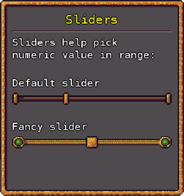

Docs: [Slider Class]( https://ronenness.github.io/GeonBit.UI-docs/html/T_GeonBit_UI_Entities_Slider.htm ).

A slider looks like an horizontal scrollbar that lets the user pick a numeric value from a pre-defined range. Its useful for stuff like difficulty level, music volume property, etc.

To create a new Slider:

```cs
// create a slider with default skin and value range of 0-10 (inclusive), and add it to a panel we created before
Slider slide = new Slider(0, 10);
panel.AddChild(slide);
```

Slider comes with two skins - default and fancy.
To create a Slider with different skin and advance parameters:

```cs
Slider slide = new Slider(min: 0, max: 10, skin: SliderSkin.Fancy, anchor: Anchor.Auto, offset: Vector2.Zero);
```

Note that slider only support positive, round numbers. If you need fractions just allow bigger min and max values, and divide result by power of 10 (depends how accurate fractions you need).

### Events

To listen and respond to when a user pick values from the slider, use the ```OnValueChange``` event handler:

```cs
slider.OnValueChange = (Entity entity) => { 
	// a user picked value from the slider
};
```

### Slider API

In addition to the basic API that every UI entity shares, ```Slider``` provide the following API:

#### Value

Get / set the current slider value. 

If you set an invalid value (outside of range), value will just clap to fit the range.

#### Min

Get / set the slider min value.

#### Max

Get / set the slider max value.

#### StepsCount

Get / set steps count on slider (often known as 'ticks')

#### GetValueAsPercent()

Get current value as a float ranging from 0.0f to 1.0f, which represent the value position between Min and Max.


## ProgressBar

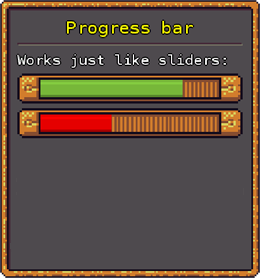

Docs: [ProgressBar Class]( https://ronenness.github.io/GeonBit.UI-docs/html/T_GeonBit_UI_Entities_ProgressBar.htm ).

A ProgressBar is just like a slider, but with graphics fitting of a progress bar. This is useful for loading screens or things like HP bar, experience bar until level up, etc..

To create a new ProgressBar:

```cs
// create a progress bar with range of 0-10 (inclusive), and add it to a panel we created before
ProgressBar prog = new ProgressBar(0, 10);
panel.AddChild(prog);
```

Unlike with Sliders, usually when using ProgressBars you don't want the user to be able to change the value. To lock ProgressBars simple use the ```Locked``` property from the base entity API.

### Events

To listen and respond to when a user pick value from the ProgressBar, use the ```OnValueChange``` event handler:

```cs
prog.OnValueChange = (Entity entity) => { 
	// a user picked value from the progress bar
};
```

### ProgressBar API

```ProgressBar``` inherit from ```Slider``` and provide the same API, plus the following:

#### ProgressFill

The image that draws the ProgressBar filled part. If you want to change color and add other effects to the fill itself, use the styling properties of this public member.


## VerticalScrollbar

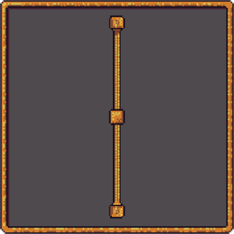

Docs: [VerticalScrollbar Class]( https://ronenness.github.io/GeonBit.UI-docs/html/T_GeonBit_UI_Entities_VerticalScrollbar.htm ).

A VerticalScrollbar is an entity used internally by GeonBit.UI (for example when list items exceed its height), but you can also create and use this entity externally.
It inherits from the Slider class and provide the same API and behavior.

To create a new VerticalScrollbar:

```cs
// create a scrollbar with range of 0-10 (inclusive), and add it to a panel we created before
VerticalScrollbar scrollbar = new VerticalScrollbar(0, 10);
panel.AddChild(scrollbar);
```

### Events

To listen and respond to when a user scroll with the scrollbar, use the ```OnValueChange``` event handler:

```cs
scrollbar.OnValueChange = (Entity entity) => { 
	// a user scrolled with the scrollbar
};
```

### VerticalScrollbar API

```VerticalScrollbar``` inherit from ```Slider``` and provide the same API, without any additions.


## Image

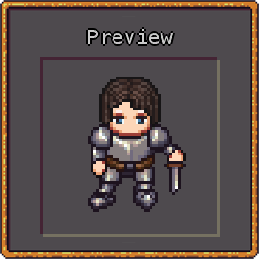

Docs: [Image Class]( https://ronenness.github.io/GeonBit.UI-docs/html/T_GeonBit_UI_Entities_Image.htm ).

An image is a renderable texture to draw in the UI.

To create a new Image:

```cs
// create a new image with texture 'texture1' and size of (100, 100), and add it to a panel we created before
Image img = new Image(texture1, new Vector2(100, 100));
panel.AddChild(img);
```

There are two draw modes for an image: Stretch, and Panel.

- **Stretch** draw mode is the default mode, that will just stretch the texture to fit the Image size.
- **Panel** draw mode is a special mode that will draw the frame of the image and tile its center parts as needed.

To understand **Panel** mode better, take a look at the panel textures that come with GeonBit.UI.

To create an Image with different mode and advance parameters:

```cs
// create a new image with texture 'texture1', size of (100, 100), panel draw mode, anchor top-center with offset of 0,10, and add it to a panel we created before
Image img = new Image(texture: texture1, size: new Vector2(100, 100), drawMode: ImageDrawMode.Panel, anchor: Anchor.TopCenter, offset: new Vector2(0, 10));
panel.AddChild(img);
```

### Image API

In addition to the basic API that every UI entity shares, ```Image``` provide the following API:

#### ImageDrawMode

The current drawing mode of the image - Stretch / Panel.

#### FrameWidth

When using Panel draw mode, this determine the frame width in percents (0f - 1f) relevant to the texture size.

#### Texture

Image texture to draw.

#### SourceRectangle

Image source rectangle.


## Icon

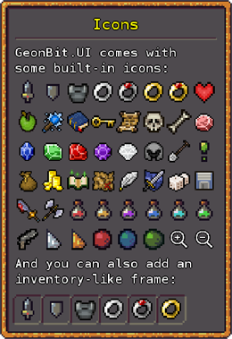

Docs: [Icon Class]( https://ronenness.github.io/GeonBit.UI-docs/html/T_GeonBit_UI_Entities_Icon.htm ).

Icon is just a type of image with a different styling, and a list of built-in icons you can pick from.

To create a new Icon:

```cs
// create a new 'Sword' icon and add it to a panel we created before
Icon icon = new Icon(IconType.Sword);
panel.AddChild(icon);
```

Icons also come with a built-int inventory-like background (cells background).
To create an Icon with background and advance parameters:

```cs
// create a new 'Sword' icon with background, scale of 1.2f, and top-left anchor with offset of 10,10
Icon icon = new Icon(IconType.Sword, anchor: Anchor.TopLeft, scale: 1.2f, background: true, offset: new Vector2(10, 10));
```

### Icon API

```Icon``` inherit from ```Image``` and provide the same API, plus the following:

#### DrawBackground

Show / hide the built-in inventory-like background.


## PanelTabs

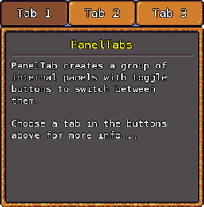

Docs: [PanelTabs Class]( https://ronenness.github.io/GeonBit.UI-docs/html/T_GeonBit_UI_Entities_PanelTabs.htm ).

A PanelTabs is a special entity you attach to panels to split them into tabs with automatic toggle buttons to switch between them.

To create a new PanelTabs:

```cs
// add tabs to a panel
PanelTabs tabs = new PanelTabs();
panel.AddChild(tabs);
```

And now to add a new tab:

```cs
// create a new tab titled "Tab 1"
// 'tab' is a struct that contains two entities: button, and panel.
PanelTabs.TabData tab = tabs.AddTab("Tab 1");
```

The code above will add a new tab with the title "Tab 1". It will also create the top button for the new tab.

The returned object, TabData, will contain 'button', which is the top button to select this tab, and 'panel', which is the panel that will be visible when this tab is selected.

### Special notice:

If you override the ```Identifier```, ```OnValueChange``` callback or ```AttachedData``` of the internal buttons and panels of the PanelTabs, things will break and not work properly.

### Events

To listen and respond to whenever user switch tabs, use the ```OnValueChange``` event handler:

```cs
tabs.OnValueChange = (Entity panelTabs) => { 
	// the user switched tabs. to get the currently active tab use tabs.ActiveTab.
};
```

### PanelTabs API

In addition to the basic API that every UI entity shares, ```PanelTabs``` provide the following API:

#### ActiveTab

Property to get the currently active tab data.

#### AddTab()

Create a new tab and return the tab object that contains the internal panel and switch button entities.


## ColoredRectangle

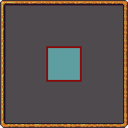

Docs: [ColoredRectangle Class]( https://ronenness.github.io/GeonBit.UI-docs/html/T_GeonBit_UI_Entities_ColoredRectangle.htm ).

ColoredRectangle is simple a renderable rectangle, with fill and outline colors.

To create a new ColoredRectangle:

```cs
// create a new rectangle with 'CadetBlue' fill, 'DarkRed' 5 pixels-width outline, size of 100x100 and anchored to center. then add it to a pre-defined panel.
ColoredRectangle rect = new ColoredRectangle(Color.CadetBlue, Color.DarkRed, 5, new Vector2(100, 100), Anchor.Center);
panel.AddChild(rect);
```


## TextInput

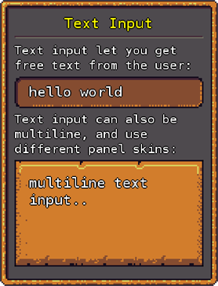

Docs: [TextInput Class]( https://ronenness.github.io/GeonBit.UI-docs/html/T_GeonBit_UI_Entities_TextInput.htm ).

A text input is an input box where user can type free textual input. It support single line or multiline input, text validators, scrollbar when needed, and placeholders.

To create a new inline TextInput:

```cs
// create a new inline text input with placeholder string "Insert text..", and add to a pre-defined panel.
TextInput text = new TextInput(false);
text.PlaceholderText = "Insert text..";
panel.AddChild(text);
```

And to create a multiline TextInput:

```cs
// create a new multiline text input with height of 220 pixels, placeholder string "Insert text..", and add to a pre-defined panel.
TextInput multiText = new TextInput(true, new Vector2(0, 220));
multiText.PlaceholderText = "Insert text..";
panel.AddChild(multiText);
```

Note that the TextInput is made of a panel with paragraphs on it, meaning you can use any panel skin as the TextInput background.
To create a TextInput with different skin and advance parameters:

```cs
// 
// create multiline text input with size of 100,220, center anchor, and golden panel skin:
TextInput multiText = new TextInput(multiline: true, size: new Vector2(100, 220), anchor: Anchor.Center, offset: Vector2.Zero, skin: PanelSkin.Golden);
```

### Events

To listen and respond to when a user type text into the TextInput, use the ```OnValueChange``` event handler:

```cs
textInput.OnValueChange = (Entity entity) => { 
	// a user typed text into the text input
};
```

### TextInput API

In addition to the basic API that every UI entity shares, ```TextInput``` provide the following API:

#### TextParagraph

The Paragraph entity used to display the input text (when TextInput is not empty). You can change the styling of this Paragraph to change how the input text looks.

#### PlaceholderParagraph

The Paragraph entity used to display the placeholder text (when TextInput is empty). You can change the styling of this Paragraph to change how the placeholder text looks.

#### CharactersLimit

Optional input-length limit.

#### LimitBySize

If true, will limit input-length to fit in TextInput physical size. This property is ```true``` by default for inline input, and ```false``` by default for multiline.

#### Validators

List of input validators / post-processors, to add special rules and limitations on this text input. For example, if you want English-only text, or numeric input only, etc.

To learn more about validators, see the docs: [TextValidators]( https://ronenness.github.io/GeonBit.UI-docs/html/N_GeonBit_UI_Entities_TextValidators.htm ).

#### PlaceholderText

Current placeholder text (text shown when TextInput is empty).

#### Value

Current text input.

#### ScrollToCaret()

If TextInput is multiline and got scrollbar, scroll to show the current caret position.

#### Caret

Current caret position.

#### ScrollPosition

If TextInput is multiline and got scrollbar, this is the scrollbar current position.

#### ResetCaret()

Reset caret position to the end of the TextInput.


## HorizontalLine

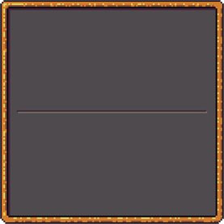

Docs: [HorizontalLine Class]( https://ronenness.github.io/GeonBit.UI-docs/html/T_GeonBit_UI_Entities_HorizontalLine.htm ).

A HorizontalLine is just an eye candy to seperate between different sections of the same panel, or to emphasize headers.

To create a new HorizontalLine:

```cs
// create a horizontal line and add it to a panel we created before
HorizontalLine hz = new HorizontalLine();
panel.AddChild(hz);
```


## LineSpace

Docs: [LineSpace Class]( https://ronenness.github.io/GeonBit.UI-docs/html/T_GeonBit_UI_Entities_LineSpace.htm ).

A LineSpace is just a simple way to create spaces between Auto-anchored entities. You can look at it like the HTML ```<br />``` tag.

To create a new LineSpace:

```cs
// create a line spacer with the size of 3 lines, and add it to a panel we created before.
// this is like adding "<br /><br /><br />" in HTML (but only affect entities with Auto anchors).
LineSpace sp = new LineSpace(3);
panel.AddChild(sp);
```

# Themes

When calling ```UserInterface.Initialize()```, you can also provide a Theme identifier parameter. for example:

```cs
UIManager = new UserInterface(Content);
UIManager.Initialize("lowres");
```

Will create a UI with a theme called "lowres".

A Theme in GeonBit.UI is the set of Textures, Effects, Fonts and StyleSheets, that define the entire look and feel of the UI system.
GeonBit.UI comes with two built-in themes, which are essentially the same style but in low-res and high-res variations (called "lowres" and "hd" respectively, "hd" being the default theme used).

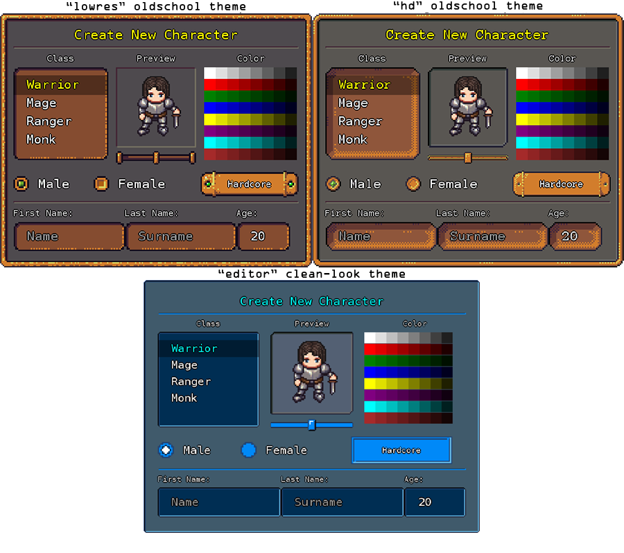

To see the available Themes you can use or to create your own theme, check out the ```Content/GeonBit.UI/themes/``` folder. The best way to create a new theme is to copy one of the built-ins and change its files:

### effects/

Contain required effects for the UI theme.

- silhouette.fx: effect to use to draw entities as colored silhouette (used to generate shadows).
- disabled.fx: effect to draw disabled entities (default implementation is in black and white).

### fonts/

Contain the SpriteFonts to use for paragraphs and texts. The fonts you use must be installed on your system when compiling them.

### styles/

XML files with default styling for all entities. There are 3 files per entity type, for default state, mouse hover, and mouse down. To see values example and extra info, check out ```example.xml```.

### textures/

All the textures for this UI theme. Note that some textures also have a data file with the same name + "_md" (for example ```panel_default_md.xml```), which contain some extra data about the texture, like frame size for panel-like textures.

### ThemeData.xml

Contain general data about the theme - name, author, extra info, credits, etc. This file is not really used inside GeonBit.UI, its just a way to attach metadata to themes.

# Final Words

## License

GeonBit.UI is distributed under the MIT license, and is 100% free to use for any commercial or non-commercial purpose.

## Contact

For bug report, questions or feature requests, please use the [github Issues](https://github.com/RonenNess/GeonBit.UI/issues/) section.

For anything else, feel free to contact me directly at [ronenness@gmail.com](mailto:ronenness@gmail.com).

## Credits

GeonBit.UI was written by Ronen Ness, but uses some free textures made by awesome people who share their work for free. 
Most of the graphics are by Michele Bucelli ("Buch"), from this OpenGameArt entry: http://opengameart.org/content/golden-ui.

In addition, I used some icons from the following sources:

- http://opengameart.org/content/roguelikerpg-icons
- http://opengameart.org/content/roguelikerpg-items
- http://opengameart.org/content/arabian-icons
- http://opengameart.org/content/2d-static-spritesicons
- http://opengameart.org/content/30-ability-icons
- http://opengameart.org/content/whispers-of-avalon-item-icons

If you like GeonBit.UI, consider supporting these artists.
